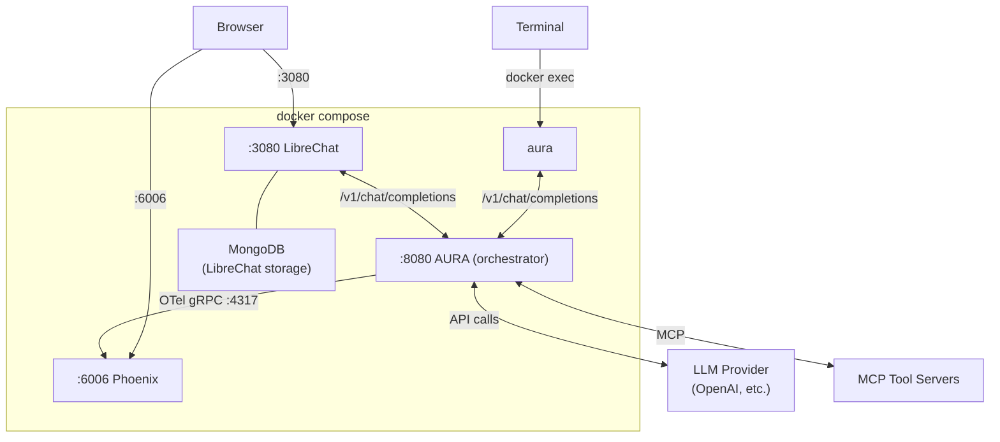

Get a fully working AI agent stack running in under a minute — AURA in **orchestrator mode**, a chat UI, and a trace viewer — all from the repo root.

**Prerequisites:** [Docker](https://docs.docker.com/get-docker/) and an LLM API key (OpenAI, Anthropic, or a local [Ollama](https://ollama.com) instance).

## 1. Configure your LLM provider

```bash
cp .env.example .env
```

Edit `.env` and set your provider, model, and API key:

```bash
LLM_PROVIDER=openai          # or: anthropic, ollama
LLM_MODEL=gpt-5.2            # or: claude-sonnet-4-20250514, llama3.1
LLM_API_KEY=sk-...            # your API key (use "unused" for Ollama/llama-server)
```

## 2. Start everything

```bash
docker compose up -d
```

AURA boots in orchestrator mode: a coordinator routes each request — answering simple ones directly and decomposing complex ones across the `researcher` and `writer` workers defined in `quickstart.toml`.

## 3. Chat with your agent

The [AURA CLI](/aura/cli-reference) ships in the same Docker image and connects to the in-container server automatically. Exec into the running container:

```bash
docker exec -it aura ./aura
```

It renders the coordinator's plan and worker activity as the response streams.

<Tip>Check startup progress with `docker compose logs -f aura`.</Tip>

### Or use a browser

| Service | URL | Description |
|---------|-----|-------------|
| LibreChat | <http://localhost:3080> | Chat with your agent |
| Phoenix | <http://localhost:6006> | Inspect LLM traces |
| AURA API | <http://localhost:8080> | OpenAI-compatible API |

**LibreChat first-time setup:** Create your user account on the signup page. The agent model is pre-configured as "Aura Orchestrator".

### Build the CLI from source

Prefer to build locally instead of using the bundled binary? Connect to the quickstart server:

```bash
cargo build -p aura-cli --release
./target/release/aura
```

The CLI defaults to **standalone mode** — it runs agents in-process from a TOML config, no server needed:

```bash
cargo build -p aura-cli --release
./target/release/aura --config quickstart.toml
```

See the [CLI Reference](/aura/cli-reference) for the full feature set.

## Customize Your Agent

Edit `quickstart.toml` to change coordinator routing and worker behavior, add tools, or enable vector search.
Edit `.env` to switch LLM providers. Then apply changes:

```bash
docker compose up -d        # picks up .env changes and recreates if needed
```

<Note>`docker compose restart aura` is fine for `quickstart.toml`-only changes, but `.env` changes require `docker compose up -d` to take effect.</Note>

### Switch LLM provider

Update `LLM_PROVIDER`, `LLM_MODEL`, and `LLM_API_KEY` in `.env`, then `docker compose up -d`.

**Anthropic:**

```bash
LLM_PROVIDER=anthropic
LLM_MODEL=claude-sonnet-4-20250514
LLM_API_KEY=sk-ant-...
```

**Ollama** (local, no API key):

```bash
LLM_PROVIDER=ollama
LLM_MODEL=llama3.1
LLM_API_KEY=unused
LLM_BASE_URL=http://host.docker.internal:11434
```

Also uncomment the `base_url` line in `quickstart.toml`.

<Warning>**Ollama + orchestration (known issue):** the quickstart defaults to orchestration mode, where `fallback_tool_parsing` is currently *not* applied to the coordinator or workers — a bug tracked in [#193](https://github.com/mezmo/aura/issues/193). Until it's fixed, a local model that relies on fallback parsing (tool calls emitted as text rather than native tool calls) can stall in orchestration. Workaround: run the quickstart in single-agent mode — set `[orchestration].enabled = false` and uncomment `fallback_tool_parsing = true` in `quickstart.toml`. Models with reliable native tool-calling work as-is. See the [Ollama guide](/aura/ollama-guide) for details.</Warning>

**[llama-server](https://github.com/ggml-org/llama.cpp/tree/master/tools/server)** (llama.cpp, local, no API key):

llama-server exposes an OpenAI-compatible API, so use the `openai` provider with a `base_url` override:

```bash
LLM_PROVIDER=openai
LLM_MODEL=local-model
LLM_API_KEY=unused
LLM_BASE_URL=http://host.docker.internal:8080/v1
```

Also uncomment the `base_url` line in `quickstart.toml`. The `LLM_MODEL` value can be anything — llama-server ignores it and uses whatever model it was started with.

### Add MCP tool servers

Uncomment the `[mcp]` section in `quickstart.toml` and point it at your MCP server:

```toml
[mcp]
sanitize_schemas = true

[mcp.servers.my_tools]
transport = "http_streamable"
url = "http://host.docker.internal:9000/mcp"
```

Use `host.docker.internal` to reach services running on your host machine.

Then scope the tools per worker: set `mcp_filter` on each worker that should use them (see [Customize orchestration](#customize-orchestration)). A worker with no `mcp_filter` receives **all** MCP tools, so set it explicitly on every tool-using worker and keep tool-free workers (like the default `writer`) on a non-matching pattern.

### Add vector search

Uncomment the `[[vector_stores]]` section in `quickstart.toml`. Options:

- **Qdrant** (self-hosted): add a Qdrant instance to the compose file or point at an external one. Embeddings can be generated via OpenAI or AWS Bedrock.
- **AWS Bedrock Knowledge Base** (managed): set `type = "bedrock_kb"` with a `knowledge_base_id` and `region`. No embedding model needed — the KB manages embeddings internally.

Registering a store under `[[vector_stores]]` only defines it — no agent can query it until you attach it. Add the store's `name` to a worker's `vector_stores` list (e.g. `vector_stores = ["docs"]`), or to `[orchestration].coordinator_vector_stores` to give the coordinator access.

See [`examples/reference.toml`](https://github.com/mezmo/aura/blob/main/examples/reference.toml) for both.

### Serve multiple agents

Create a directory with one TOML file per agent:

```
configs/
├── research-assistant.toml
├── devops-agent.toml
└── code-reviewer.toml
```

Then update `docker-compose.yml` to mount and serve the directory:

```yaml
    environment:
      CONFIG_PATH: "/app/config/configs"
    volumes:
      - ./configs:/app/config/configs:ro
```

Restart with `docker compose up -d`. Clients that support model selection (LibreChat, OpenWebUI, etc.) will show each agent in their model picker via `GET /v1/models`.

<Note>The example configs in `examples/` reference provider-specific env vars (e.g. `OPENAI_API_KEY`) rather than the quickstart's `LLM_API_KEY`. Add the appropriate keys to your `.env` — they're automatically loaded into the container via `env_file`. See `.env.example` for the full list.</Note>

#### Hide an agent from discovery

Set `hidden = true` in an agent's `[agent]` block to keep it out of discovery listings. AURA omits a hidden agent from the `GET /v1/models` response and from the CLI's `/model` list, so it won't appear in client model pickers. The agent stays fully usable. Any caller that already knows its name or alias can still select it by sending that value as the `model` field. This helps when an agent isn't ready yet, or when you want only known callers to invoke it during development/testing/production.

```toml
[agent]
name = "hidden agent"
hidden = true
system_prompt = "You are a hidden agent that does not show up in listings, but still invokable by known callers."
```

The `hidden` field defaults to `false`. It accepts either a TOML boolean (`true` or `false`) or the quoted strings `"true"` and `"false"`. The quoted form is convenient when a templating tool such as Helm renders the value as a string.

<Note>If you load only a single hidden agent, both `GET /v1/models` and the CLI `/model` list come back empty even though the agent is still the active, invocable default.</Note>

### Customize orchestration

`quickstart.toml` ships with orchestration enabled: a coordinator and two tool-free workers (`researcher` and `writer`) that reason with the LLM alone. The coordinator's routing is controlled by the `[orchestration]` block:

```toml
[orchestration]
enabled = true
max_planning_cycles = 2
allow_direct_answers = true    # simple queries answered without workers
allow_clarification = true     # vague requests prompt follow-up questions
tools_in_planning = "summary"  # coordinator sees tool names during planning
```

Each `[orchestration.worker.<name>]` block defines a worker. Give a worker tools by configuring an MCP server (see [Add MCP tool servers](#add-mcp-tool-servers) above) and listing matching tool globs in its `mcp_filter`, or point it at a vector store via `vector_stores`:

```toml
[orchestration.worker.operations]
description = "Operational analysis and diagnostics"
preamble = """
You are an operations specialist completing one assigned task.
Use your tools for every operation — do not guess results.
"""
mcp_filter = ["ops_*"]         # glob patterns selecting which MCP tools this worker can use
turn_depth = 5

[orchestration.worker.knowledge]
description = "Documentation and knowledge retrieval"
preamble = """
You are a knowledge specialist completing one assigned task.
Search available documentation to answer the question.
"""
mcp_filter = ["__none__"]      # non-matching pattern: no MCP tools, vector search only
vector_stores = ["docs"]
turn_depth = 5
```

<Note>A worker whose `mcp_filter` is omitted or empty (`[]`) is granted **every** MCP tool, not none. Set an explicit `mcp_filter` on each worker once an MCP server is configured, and use a non-matching pattern (e.g. `["__none__"]`) for any worker you want to keep tool-free.</Note>

Each worker inherits the agent's LLM by default. To run a worker on a different model, add a complete `[orchestration.worker.<name>.llm]` block — see the [orchestration config reference](/aura/configuration-reference#orchestration) for all fields.

Restart with `docker compose restart aura` and try asking a multi-step question. Watch the coordinator plan and dispatch in the CLI's event panel, or in Phoenix at <http://localhost:6006>.

To run a single agent instead of orchestration, set `[orchestration].enabled = false` and configure a single `[agent]` — see [`examples/reference.toml`](https://github.com/mezmo/aura/blob/main/examples/reference.toml).

For a fully self-contained orchestration example with a math MCP server, see the [Orchestration — Math MCP quickstart](/aura/quickstart-orchestration-math).

### Full configuration reference

See [`examples/reference.toml`](https://github.com/mezmo/aura/blob/main/examples/reference.toml) for all available options.

## What's Next

Once the basic quickstart is running, try these more advanced setups:

- **[Orchestration Quickstart](/aura/quickstart-orchestration-math)** — Multi-agent orchestration with a coordinator that dispatches tasks to specialized workers. Uses a math MCP server to demonstrate parallel task execution.
- **[Kubernetes SRE Quickstart](/aura/quickstart-k8s-sre)** — Deploy an AI-powered SRE agent on a KIND cluster with real Kubernetes and Prometheus MCP servers.
- **[Example Configs](/aura/example-configs)** — Minimal per-provider configs and complete agent compositions to use as starting points.

## Architecture



- **aura** runs inside the AURA container (`docker exec`) and talks to the same OpenAI-compatible `/v1/chat/completions` endpoint, rendering coordinator and worker events as they stream.
- **LibreChat** sends chat requests to AURA's OpenAI-compatible `/v1/chat/completions` endpoint. MongoDB is used by LibreChat internally for user accounts and conversation history — AURA does not use it.
- **AURA** runs the coordinator that routes each request, dispatches workers, executes MCP tools, calls the configured LLM provider, and streams responses back.
- **Phoenix** receives OpenTelemetry traces from AURA so you can inspect every coordinator and worker step.

## Troubleshooting

**LibreChat shows "no models available"**
AURA may still be starting. Wait for the health check to pass (`docker compose logs aura --tail 5`) and refresh.

**"connection refused" in AURA logs**
If referencing services on your host, use `host.docker.internal` instead of `localhost` in `quickstart.toml`.

**Reset everything**

```bash
docker compose down -v
```
