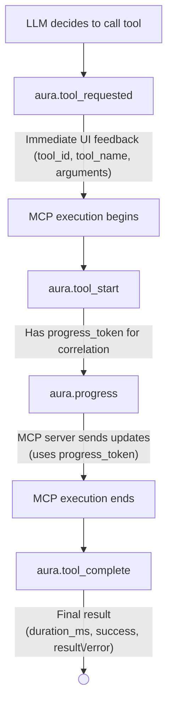
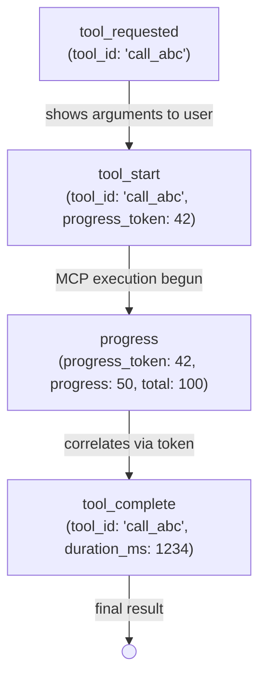
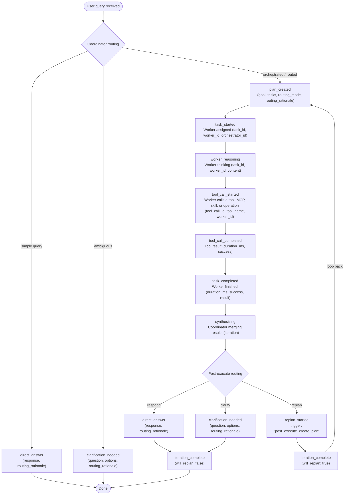
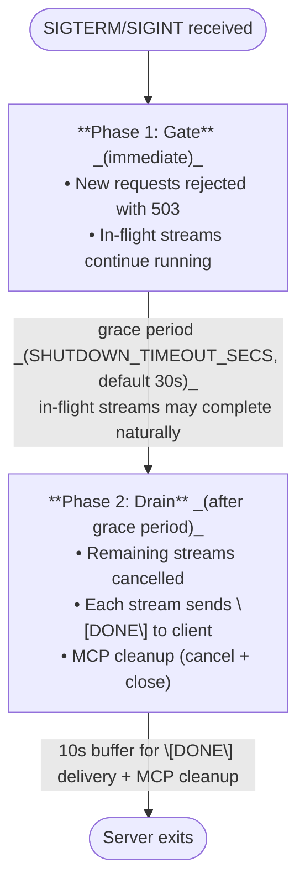

OpenAI-compatible Server-Sent Events (SSE) streaming for real-time responses.

## Quick Start

```bash
curl -X POST http://localhost:8080/v1/chat/completions \
  -H "Content-Type: application/json" \
  -d '{"messages": [{"role": "user", "content": "Hello!"}], "stream": true}'
```

## Configuration

### Tool Result Modes

The server supports three streaming modes, configured via CLI or environment variable:

| Mode | Tool Call Args | Tool Results | Use Case |
|------|----------------|--------------|----------|
| `none` (default) | Actual JSON | Not streamed | Spec-compliant API clients |
| `open-web-ui` | Empty `""` | Streamed via `tool_calls` | OpenWebUI "View Results" support |
| `aura` | Actual JSON | Via `aura.tool_complete` events | Custom clients with AURA events |

```bash
# Spec-compliant mode (default)
cargo run --bin aura-web-server

# OpenWebUI compatibility mode
cargo run --bin aura-web-server -- --tool-result-mode open-web-ui

# AURA events mode (requires AURA_CUSTOM_EVENTS=true)
AURA_CUSTOM_EVENTS=true cargo run --bin aura-web-server -- --tool-result-mode aura

# Via environment variable
TOOL_RESULT_MODE=aura AURA_CUSTOM_EVENTS=true cargo run --bin aura-web-server
```

### Environment Variables

| Variable | Default | Description |
|----------|---------|-------------|
| `TOOL_RESULT_MODE` | `none` | `none`, `open-web-ui`, or `aura` |
| `TOOL_RESULT_MAX_LENGTH` | `1000` | Max chars for tool results (0 = no truncation) |
| `STREAMING_TIMEOUT_SECS` | `900` | Request timeout in seconds (0 = no timeout) |
| `FIRST_CHUNK_TIMEOUT_SECS` | `90` | Max seconds to wait for first provider chunk before aborting |
| `STREAMING_BUFFER_SIZE` | `400` | Chunks to buffer before backpressure |
| `AURA_CUSTOM_EVENTS` | `false` | Enable optional custom `aura.*` events. HITL approval lifecycle events are emitted regardless because clients may need to act on them. |
| `AURA_EMIT_REASONING` | `false` | Enable `aura.reasoning` events |
| `SHUTDOWN_TIMEOUT_SECS` | `30` | Grace period (seconds) for in-flight streams on shutdown |

## Server Info Endpoint

`GET /aura/info` is an aura-native introspection endpoint. It returns the
default agent and, per agent, its orchestration workers and configured MCP
servers. This endpoint is not OpenAI-compatible; it lives under `/aura/` to keep
`/v1/models` clean.

The CLI uses this at boot to display orchestration workers before the first
prompt in HTTP mode.

```bash
curl http://localhost:8080/aura/info | jq
```

```json
{
  "default_agent": "orch",
  "agents": [
    {
      "id": "orch",
      "model": "gpt-4o",
      "workers": [
        { "name": "planner", "description": "Plans work" },
        { "name": "writer", "description": "Writes summaries", "model": "gpt-4o-mini" }
      ],
      "mcp_servers": {
        "logs": {
          "transport": "http_streamable",
          "url": "https://logs.example.com",
          "description": "Search logs."
        },
        "fs": { "transport": "stdio", "command": "fs-server" }
      }
    },
    {
      "id": "solo",
      "model": "gpt-4o",
      "mcp_servers": {}
    }
  ]
}
```

Each agent's `id` matches the `id` field in `/v1/models` (alias if set,
otherwise agent name). The `workers` array is omitted for non-orchestration
agents. Each worker's `model` is included only when it overrides the
coordinator model.

`mcp_servers` is a credential-free view of the agent's configured MCP servers,
keyed by name and tagged by `transport` (`stdio`, `http_streamable`, or `sse`).
URLs are reduced to their origin (`scheme://host:port`) — path, query,
fragment, and userinfo are all dropped, since any of them can carry a token. A
stdio server shows only the executable basename as `command`; its arguments
and environment are never included, and neither are `headers` or
`headers_from_request`. A URL that cannot be reduced to an origin appears as
the sentinel `<invalid url>`, and a command with no extractable file name as
`<unknown>`. An empty object means no configured MCP servers, while
a populated one lists them. Older servers omit the field entirely, and the CLI
then uses its generic startup call-to-action.

## Custom AURA Events (Optional)

Most custom AURA events are optional and require `AURA_CUSTOM_EVENTS=true`.
HITL approval lifecycle events are the exception: the server emits them whenever
an approval route needs clients to observe or act on approval state.

```bash
AURA_CUSTOM_EVENTS=true cargo run --bin aura-web-server
```

### Custom Event Types

| Event | Description | Status |
|-------|-------------|--------|
| `aura.tool_requested` | LLM decided to call a tool (immediate UI feedback, has arguments) | ✅ Implemented |
| `aura.tool_start` | MCP execution actually begins (has `progress_token` for correlation) | ✅ Implemented |
| `aura.tool_complete` | Tool execution finished (with `duration_ms`, result/error) | ✅ Implemented |
| `aura.reasoning` | LLM reasoning content (requires `AURA_EMIT_REASONING=true`) | ✅ Implemented |
| `aura.progress` | MCP progress notifications during long-running tools | ✅ Implemented |
| `aura.session_info` | Session metadata (model, context window) emitted at stream start | ✅ Implemented |
| `aura.mcp_status` | Per-server MCP connection status emitted at stream start (connected/failed/not_attempted, with failure reason) | ✅ Implemented |
| `aura.worker_phase` | Worker phase transitions in multi-agent mode (planning/executing/analyzing) | ✅ Implemented |
| `aura.tool_usage` | Usage snapshot after tool execution (associates tool IDs with token counts) | ✅ Implemented |
| `aura.usage` | Final token usage emitted at stream end (prompt/completion/total) | ✅ Implemented |
| `aura.scratchpad_usage` | Per-agent scratchpad usage summary (single-agent or worker), emitted when an agent finishes with scratchpad activity | ✅ Implemented |
| `aura.approval_requested` | HITL approval request raised for a gated tool or `request_approval` call | ✅ Implemented for webhook and conversational routes |
| `aura.approval_pending` | HITL approval is waiting for an attended decision | ✅ Implemented for conversational route |
| `aura.approval_completed` | HITL approval reached a terminal outcome | ✅ Implemented for webhook and conversational routes |
| `aura.orchestrator.*` | Orchestration lifecycle events (see [Orchestration Events](#orchestration-events) below) | ✅ Implemented |

### Event Flow



### Event Formats

Custom events use the SSE `event:` field to distinguish from standard OpenAI chunks:

**Tool requested** (immediate UI feedback when LLM decides to call a tool):
```
event: aura.tool_requested
data:
```
```json
{
  "tool_id": "call_abc123",
  "tool_name": "list_files",
  "arguments": {"path": "/tmp"},
  "agent_id": "main",
  "session_id": "sess_xyz"
}
```

**Tool start** (when MCP execution actually begins):
```
event: aura.tool_start
data:
```
```json
{
  "tool_id": "call_abc123",
  "tool_name": "list_files",
  "progress_token": 42,
  "agent_id": "main",
  "session_id": "sess_xyz"
}
```

Note: `progress_token` is included when available from the MCP client. Use it to correlate with `aura.progress` events.

**Tool complete (success)**:
```
event: aura.tool_complete
data:
```
```json
{
  "tool_id":"call_abc123",
  "tool_name":"list_files",
  "duration_ms":1234,
  "success":true,
  "result":"file1.txt\nfile2.txt... [truncated]",
  "agent_id":"main",
  "session_id":"sess_xyz"
}
```

**Tool complete (failure)**:
```
event: aura.tool_complete
data:
```
```json
{
  "tool_id": "call_abc123",
  "tool_name": "failing_tool",
  "duration_ms": 50,
  "success": false,
  "error": "Tool returned an error: Connection refused",
  "agent_id": "main",
  "session_id": "sess_xyz"
}
```

Note:
- Successful tool results include the `result` field (truncated per `TOOL_RESULT_MAX_LENGTH`, default 1000 chars)
- Tool errors are automatically detected from Rig's error format prefixes (`ToolCallError:`, `JsonError:`, `Tool returned an error:`)
- When detected, `success` is set to `false` and the `error` field contains the full error message

**Reasoning** (requires both flags):
```bash
AURA_CUSTOM_EVENTS=true AURA_EMIT_REASONING=true cargo run --bin aura-web-server
```
```
event: aura.reasoning
data:
```
```json
{
  "content": "Let me analyze the request...",
  "agent_id": "main",
  "session_id": "sess_xyz"
}
```

**Progress** (MCP notifications from long-running tools):
```
event: aura.progress
data:
```
```json
{
  "message": "Processing step 3 of 5",
  "phase": "mcp_progress",
  "percent": 60,
  "progress_token": 42,
  "agent_id": "main",
  "session_id": "sess_xyz"
}
```

Note: Progress events are only emitted when:
1. `AURA_CUSTOM_EVENTS=true` is set
2. The MCP server sends `notifications/progress` messages during tool execution

**Session info** (emitted once at stream start):
```
event: aura.session_info
data:
```
```json
{
  "model": "gpt-5.2",
  "model_context_limit": 200000,
  "session_id": "sess_xyz"
}
```

Note: `aura.session_info` includes only `CorrelationContext` fields (`session_id`, `trace_id`) — no `agent_id`. `model_context_limit` comes from the `context_window` field in the `[agent.llm]` TOML config section (or `[orchestration.worker.<name>.llm]` for per-worker overrides). If `context_window` is not set, `model_context_limit` is omitted from the event.

**MCP status** (emitted once when at least one MCP server is configured — at stream start in single-agent mode, or just after the shared manager connects in orchestration mode):
```
event: aura.mcp_status
data:
```
```json
{
  "servers": [
    {
      "server_name": "mezmo",
      "transport": "http_streamable",
      "status": "connected",
      "tools_count": 7
    },
    {
      "server_name": "pagerduty",
      "transport": "http_streamable",
      "status": "failed",
      "tools_count": 0,
      "reason": "Connection failed: HTTP MCP server 'pagerduty' authentication failed (401 Unauthorized). Check that your headers, forwarded headers. and/or credentials are correct."
    }
  ],
  "session_id": "sess_xyz"
}
```

Note: `status` is one of `connected`, `failed`, or `not_attempted`. This lets a client distinguish a server that is configured but unavailable (`failed`, with a `reason`) from one that connected and legitimately exposes no tools (`connected`, `tools_count: 0`). `reason` is present only for failed servers. The event is omitted entirely when no servers are configured. `aura.mcp_status` includes only `CorrelationContext` fields (`session_id`, `trace_id`) — no `agent_id`.

In orchestration mode all workers share a single `McpManager`, so one `aura.mcp_status` reports the whole run's server status. The wire shape is identical to single-agent mode; it just arrives slightly later (after the manager connects, before planning) rather than at stream start. Requires `AURA_CUSTOM_EVENTS=true` in both modes.

**Worker phase** (phase transitions in multi-agent mode):
```
event: aura.worker_phase
data:
```
```json
{
  "phase": "executing",
  "task_id": "task_1",
  "agent_id": "log_worker",
  "parent_agent_id": "coordinator",
  "session_id": "sess_xyz"
}
```

Possible `phase` values: `"planning"`, `"executing"`, `"analyzing"`. `task_id` and `parent_agent_id` are omitted when not set.

**Tool usage** (usage snapshot after tool execution rounds):
```
event: aura.tool_usage
data:
```
```json
{
  "tool_ids": ["call_abc123", "call_def456"],
  "prompt_tokens": 18777,
  "completion_tokens": 500,
  "total_tokens": 19277,
  "session_id": "sess_xyz"
}
```

Emitted from the `on_stream_completion_response_finish` hook when usage data is available. Associates the completed tool IDs with a token usage snapshot. No `agent_id` field (only `CorrelationContext`).

**Usage** (final token usage at stream end):
```
event: aura.usage
data:
```
```json
{
  "prompt_tokens": 21500,
  "completion_tokens": 342,
  "total_tokens": 21842,
  "session_id": "sess_xyz"
}
```

Use `prompt_tokens` with `model_context_limit` from `aura.session_info` to calculate context window fill percentage: `(prompt_tokens / model_context_limit) * 100`. No `agent_id` field (only `CorrelationContext`).

**Scratchpad usage** (per-agent report when an agent finishes with scratchpad activity):
```
event: aura.scratchpad_usage
data: {"agent_id":"main","tokens_intercepted":15840,"tokens_extracted":1200,"session_id":"sess_xyz"}
```

Emitted once per agent that used scratchpad. It fires for both single-agent and orchestration worker contexts (in the latter, `agent_id` is the worker name). `tokens_intercepted` is the total tool output diverted to disk; `tokens_extracted` is what the agent pulled back into context via the scratchpad exploration tools.

**Approval requested** (HITL approval request raised):
```
event: aura.approval_requested
data:
```
```json
{
  "decision_id": "019edead-beef-7000-8000-000000000001",
  "tool_name": "restart_deployment",
  "origin": {
    "kind": "config_gate",
    "matched_pattern": "restart_*"
  },
  "scope": {
    "kind": "worker",
    "run_id": "019edead-beef-7000-8000-000000000002",
    "task_id": 3,
    "worker": "operations",
    "session_id": "sess_xyz"
  }
}
```

**Approval pending** (conversational HITL is waiting for an attended decision):
```
event: aura.approval_pending
data:
```
```json
{
  "decision_id": "019edead-beef-7000-8000-000000000001",
  "tool_name": "restart_deployment",
  "arguments": {"namespace": "prod", "deployment": "api"},
  "origin": {
    "kind": "config_gate",
    "matched_pattern": "restart_*"
  },
  "scope": {
    "kind": "worker",
    "run_id": "019edead-beef-7000-8000-000000000002",
    "task_id": 3,
    "worker": "operations",
    "session_id": "sess_xyz"
  },
  "expires_at": "2026-06-23T22:15:30Z"
}
```

**Approval completed** (HITL approval reached a terminal outcome):
```
event: aura.approval_completed
data:
```
```json
{
  "decision_id": "019edead-beef-7000-8000-000000000001",
  "outcome": {
    "kind": "denied",
    "reason": "maintenance window not open"
  },
  "duration_ms": 1820,
  "scope": {
    "kind": "worker",
    "run_id": "019edead-beef-7000-8000-000000000002",
    "task_id": 3,
    "worker": "operations",
    "session_id": "sess_xyz"
  }
}
```

Approval events are emitted even when `AURA_CUSTOM_EVENTS=false` because they are
protocol lifecycle events, not optional telemetry. The webhook route emits
`aura.approval_requested` before dispatch and `aura.approval_completed` for all
terminal webhook outcomes. The conversational route emits
`aura.approval_requested`, then `aura.approval_pending` while the tool call is
parked, then `aura.approval_completed` after the decision, timeout, or
cancellation. `outcome.kind` is one of `approved`, `denied`, `timed_out`,
`cancelled`, or `errored`; `errored` represents channel faults such as transport
errors, non-2xx responses, or invalid JSON. `aura.approval_pending` is reserved
for the conversational route and is not emitted by the webhook route.

### Client Handling

Standard OpenAI clients will ignore these events (they only process `data:` lines without `event:` prefix). Custom clients can filter by event type:

<!-- vale off -->
```javascript
for (const line of chunk.split('\n')) {
  if (line.startsWith('event: ')) {
    const eventType = line.slice(7);
  }
  if (line.startsWith('data: ')) {
    const data = JSON.parse(line.slice(6));
    // Handle OpenAI chunk or custom event data
  }
}
```
<!-- vale on -->

### Correlation Fields

Most custom events include correlation fields for tracing:

| Field | Description |
|-------|-------------|
| `session_id` | Chat session ID (from request metadata) |
| `trace_id` | OTEL trace ID (when available) |
| `agent_id` | Agent identifier (`main` for single-agent) |

Approval lifecycle events carry `decision_id` and HITL `scope` instead of the shared `AgentContext` / `CorrelationContext` fields. Use `decision_id` to correlate `aura.approval_requested` with `aura.approval_completed`, and inspect `scope` for the requesting surface (`single`, `worker`, or future `coordinator`).

#### Tool Event Correlation

Use these fields to correlate tool-related events:

| Correlation | Events | Field |
|-------------|--------|-------|
| Tool lifecycle | `tool_requested` → `tool_start` → `tool_complete` | `tool_id` |
| Progress updates | `tool_start` → `progress` | `progress_token` |

Example correlation:


## Orchestration Events

When `orchestration.enabled = true` and `AURA_CUSTOM_EVENTS=true`, the server emits orchestration-specific events covering the Plan/Execute/Continue lifecycle. These events are emitted alongside the standard `aura.*` events above.

### Orchestration Event Types

| Event | Description |
|-------|-------------|
| `aura.orchestrator.plan_created` | Coordinator decomposed query into a task DAG |
| `aura.orchestrator.direct_answer` | Coordinator answered without orchestration |
| `aura.orchestrator.clarification_needed` | Coordinator needs user clarification |
| `aura.orchestrator.task_started` | Worker began executing a task |
| `aura.orchestrator.task_completed` | Worker finished task (success/failure with duration) |
| `aura.orchestrator.worker_reasoning` | Worker reasoning content with task/worker attribution |
| `aura.orchestrator.iteration_complete` | Iteration finished with replan decision, reasoning, and phase timing (planning/execution/tool ms) |
| `aura.orchestrator.replan_started` | Replan cycle triggered (coordinator-routed or task failures) |
| `aura.orchestrator.synthesizing` | Coordinator merging worker results (includes iteration number) |
| `aura.orchestrator.tool_call_started` | A tool call began (coordinator or worker); see the tool-coverage note below |
| `aura.orchestrator.tool_call_completed` | The matching tool call finished (duration, success) |

### Orchestration Event Flow



**Routing decisions happen twice**: once on initial query (before any work) and again post-execute (after workers finish). Both paths can produce `direct_answer`, `clarification_needed`, or a new plan. The initial routing has no `iteration_complete`; the post-execute routing always emits one.

### Orchestration Event Formats

**Plan created** (coordinator decomposed query into tasks):
```
event: aura.orchestrator.plan_created
data:
```
```json
{
  "goal": "Calculate (3+7)*2 and list files",
  "tasks": ["Calculate (3+7)*2", "List files in /tmp"],
  "routing_mode": "orchestrated",
  "routing_rationale": "Multi-step: arithmetic + file listing",
  "agent_id": "coordinator",
  "session_id": "sess_xyz"
}
```

The `routing_mode` field indicates how the coordinator routed the query:
- `"routed"` — classified to a single worker
- `"orchestrated"` — multi-task DAG with continuation

The optional `planning_response` field contains the coordinator's raw planning text and is omitted when empty.

**Direct answer** (coordinator answered without orchestration):
```
event: aura.orchestrator.direct_answer
data:
```
```json
{
  "response": "The answer is 42",
  "routing_rationale": "Simple factual query, no tools needed",
  "agent_id": "coordinator",
  "session_id": "sess_xyz"
}
```

**Clarification needed** (coordinator needs more information):
```
event: aura.orchestrator.clarification_needed
data:
```
```json
{
  "question": "Which environment should I check?",
  "options": ["production", "staging", "development"],
  "routing_rationale": "Ambiguous target environment",
  "agent_id": "coordinator",
  "session_id": "sess_xyz"
}
```

Note: `options` is omitted when the coordinator does not suggest choices.

**Task started** (worker begins execution):
```
event: aura.orchestrator.task_started
data:
```
```json
{
  "task_id": 0,
  "description": "Calculate (3+7)*2",
  "worker_id": "arithmetic",
  "orchestrator_id": "orch-1",
  "agent_id": "coordinator",
  "session_id": "sess_xyz"
}
```

**Worker reasoning** (worker thinking with attribution):
```
event: aura.orchestrator.worker_reasoning
data:
```
```json
{
  "task_id": 0,
  "worker_id": "arithmetic",
  "content": "I need to add 15 and 27...",
  "agent_id": "coordinator",
  "session_id": "sess_xyz"
}
```

Note: requires both `AURA_CUSTOM_EVENTS=true` and `AURA_EMIT_REASONING=true`. Worker reasoning is also emitted as `aura.reasoning` with `agent_id` set to the worker name (e.g., `"arithmetic"`) and `parent_agent_id: "coordinator"` for backward-compatible aggregation.

**Tool call started** (coordinator or worker calls a tool):
```
event: aura.orchestrator.tool_call_started
data:
```
```json
{
  "task_id": 0,
  "tool_call_id": "call_abc123",
  "tool_name": "add",
  "worker_id": "arithmetic",
  "arguments": {"a": 3, "b": 7},
  "agent_id": "coordinator",
  "session_id": "sess_xyz"
}
```

Note: `task_id` is omitted if it could not be determined. `arguments` is omitted when not available.

**Tool call completed** (the matching tool call finished):
```
event: aura.orchestrator.tool_call_completed
data:
```
```json
{
  "task_id": 0,
  "tool_call_id": "call_abc123",
  "success": true,
  "duration_ms": 42,
  "result": "10",
  "agent_id": "coordinator",
  "session_id": "sess_xyz"
}
```

Note: `task_id` is omitted if it could not be determined. `result` is truncated per `TOOL_RESULT_MAX_LENGTH` and omitted when empty.

**Tool coverage:** these events fire for the coordinator (`worker_id: "main"`) as well as workers. They cover MCP tools, the skill tools (`load_skill`, `read_skill_file`), and orchestration operations (`read_artifact`, `submit_result`, `list_prior_runs`). Scratchpad exploration tools are suppressed by default and emit only when `AURA_EMIT_SCRATCHPAD_TOOL_EVENTS` is set.

**Task completed** (worker finished with result):
```
event: aura.orchestrator.task_completed
data:
```
```json
{
  "task_id": 0,
  "success": true,
  "duration_ms": 1500,
  "orchestrator_id": "orch-1",
  "worker_id": "arithmetic",
  "result": "The result is 20",
  "agent_id": "coordinator",
  "session_id": "sess_xyz"
}
```

**Iteration complete** (replan decision after execution):
```
event: aura.orchestrator.iteration_complete
data:
```
```json
{
  "iteration": 1,
  "will_replan": false,
  "reasoning": "All tasks completed successfully",
  "planning_ms": 1180,
  "execution_ms": 4620,
  "task_compute_ms": 4500,
  "tool_ms": 820,
  "agent_id": "coordinator",
  "session_id": "sess_xyz"
}
```

The `reasoning` and `gaps` fields are included only when non-empty (i.e., when replanning is triggered).

**Phase timing fields** (all milliseconds, present on every `iteration_complete`):

| Field | Meaning |
|-------|---------|
| `planning_ms` | Prompt → plan created. Includes planning-correction retries. For replanned iterations this is the prior iteration's continuation-decision latency (that call produced this iteration's plan). |
| `execution_ms` | Plan ready → continuation-prompt entrypoint — one iteration's execution span (worker waves + persistence drain + result consolidation), measured as wall-clock. |
| `task_compute_ms` | Sum of per-task wall durations across the iteration (aggregate compute; exceeds `execution_ms` when tasks run in parallel). |
| `tool_ms` | Sum of tool-call durations recorded for the iteration's tasks. |

To separate time the LLM spent *deciding what to call* from time spent *executing tools*, compute `execution_ms - tool_ms` ≈ LLM-thinking time. This is exact for single-task routes; for parallel waves it is approximate, since `tool_ms` and `task_compute_ms` are summed compute rather than wall-clock — compare them against `execution_ms` to gauge overlap. The same four fields are written to the run manifest (`phase_timings`) and recorded as `orchestration.{planning,execution,task_compute,tool}_ms` attributes on the `orchestration.iteration` OTel span.

**Replan started** (new planning cycle triggered):
```
event: aura.orchestrator.replan_started
data:
```
```json
{
  "iteration": 2,
  "trigger": "post_execute_create_plan",
  "agent_id": "coordinator",
  "session_id": "sess_xyz"
}
```

Triggers: `"post_execute_create_plan"` (coordinator routed back to planning after evaluating worker results).

**Synthesizing** (consolidating task results for coordinator decision):
```
event: aura.orchestrator.synthesizing
data:
```
```json
{
  "iteration": 1,
  "agent_id": "coordinator",
  "session_id": "sess_xyz"
}
```

Fires before the post-execute coordinator call. Bookends with `iteration_complete`, which fires after the coordinator's routing decision.

Note: Workers that use scratchpad emit `aura.scratchpad_usage` when they finish — see the [Custom Event Types](#custom-event-types) section above. This is a base `aura.*` event (not orchestration-specific) so the same event fires for single-agent deployments and workers alike.

### Orchestration Correlation

<!-- vale off -->
| Correlation | Events | Field |
|-------------|--------|-------|
| Task lifecycle | `task_started` → `worker_reasoning` → `tool_call_*` → `task_completed` | `task_id` |
| Tool lifecycle | `tool_call_started` → `tool_call_completed` | `tool_call_id` |
| Worker identity | `task_*`, `worker_reasoning`, `tool_call_started` | `worker_id` |
| Agent hierarchy | All orchestration events | `agent_id` (`"coordinator"` or worker name) |
| Replan cycle | `iteration_complete` → `replan_started` → `plan_created` | `iteration` |
<!-- vale on -->

## SSE Event Reference

### Event Types by Mode

| Event | Description | `none` | `open-web-ui` | `aura` |
|-------|-------------|:------:|:------------:|:------:|
| **Text chunk** | Token-by-token content | ✅ | ✅ | ✅ |
| **Tool call** | Tool name + arguments | ✅ (with args) | ✅ (empty args) | ✅ (with args) |
| **Tool result** | Tool execution output | - | ✅ (via `tool_calls`) | ✅ (via aura.tool_complete) |
| **Final chunk** | `finish_reason` + usage | ✅ | ✅ | ✅ |
| **[DONE]** | Stream termination | ✅ | ✅ | ✅ |

### Message Formats

**First text chunk** (includes `role`):
```json
{
  "choices": [
    {
      "delta": {
        "role": "assistant",
        "content": "Hello"
      }
    }
  ]
}
```

**Subsequent text chunks**:
```json
{
  "choices": [
    {
      "delta": {
        "content": " world"
      }
    }
  ]
}
```

**Tool call (`none` mode)** - includes actual arguments:
```json
{
  "choices": [
    {
      "delta": {
        "tool_calls": [
          {
            "index": 0,
            "id": "call_xyz",
            "type": "function",
            "function": {
              "name": "list_files",
              "arguments": "{\"path\":\"/tmp\"}"
            }
          }
        ]
      }
    }
  ]
}
```

**Tool call (`open-web-ui` mode)** - empty arguments for UI compatibility:
```json
{
  "choices": [
    {
      "delta": {
        "tool_calls": [
          {
            "index": 0,
            "id": "call_xyz",
            "type": "function",
            "function": {
              "name": "list_files",
              "arguments": ""
            }
          }
        ]
      }
    }
  ]
}
```

**Tool result (`open-web-ui` mode only)** - sent as second delta with same index:
```json
{
  "choices": [
    {
      "delta": {
        "tool_calls": [
          {
            "index": 0,
            "id": "call_xyz",
            "type": "function",
            "function": {
              "name": "",
              "arguments": "{\"files\":[\"a.txt\",\"b.txt\"]}"
            }
          }
        ]
      }
    }
  ]
}
```

**Final chunk**:
```json
{
  "choices": [
    {
      "delta": {},
      "finish_reason": "stop"
    }
  ],
  "usage": {
    "prompt_tokens": 10,
    "completion_tokens": 20,
    "total_tokens": 30
  }
}
```

**Stream end**:
```
data: [DONE]
```

### `finish_reason` Values

| Value | Meaning |
|-------|---------|
| `stop` | Normal completion |
| `tool_calls` | Response included tool execution |
| `length` | Response truncated due to `max_tokens` limit |

## Client Examples

### JavaScript

```javascript
const response = await fetch('/v1/chat/completions', {
  method: 'POST',
  headers: { 'Content-Type': 'application/json' },
  body: JSON.stringify({
    messages: [{ role: 'user', content: 'List files in /tmp' }],
    stream: true
  })
});

const reader = response.body.getReader();
const decoder = new TextDecoder();

while (true) {
  const { done, value } = await reader.read();
  if (done) break;

  for (const line of decoder.decode(value).split('\n')) {
    if (!line.startsWith('data: ')) continue;
    const data = line.slice(6);
    if (data === '[DONE]') break;

    const chunk = JSON.parse(data);
    const delta = chunk.choices[0]?.delta;

    if (delta?.content) {
      process.stdout.write(delta.content);
    }
    if (delta?.tool_calls) {
      console.log('Tool call:', delta.tool_calls[0].function.name);
    }
  }
}
```

### Python

```python
import httpx
import json

with httpx.stream('POST', 'http://localhost:8080/v1/chat/completions',
    json={'messages': [{'role': 'user', 'content': 'Hello!'}], 'stream': True}
) as response:
    for line in response.iter_lines():
        if not line.startswith('data: '): continue
        data = line[6:]
        if data == '[DONE]': break

        chunk = json.loads(data)
        delta = chunk['choices'][0].get('delta', {})

        if content := delta.get('content'):
            print(content, end='', flush=True)
        if tool_calls := delta.get('tool_calls'):
            print(f"\nTool: {tool_calls[0]['function']['name']}")
```

## Multi-Turn Tool Execution

Unlike standard OpenAI API (where tool execution is client-side), this server executes tools server-side and continues streaming. After tool execution completes, text resumes with a `\n\n` separator for readability:

```
I'll check that for you.
[tool call: list_files]
[tool executes server-side]

Here are the files I found:
...
```

The separator is automatically injected when text chunks resume after a `ToolResult` event.

## Connection Behavior

| Behavior | Description |
|----------|-------------|
| **Timeout** | 900s default (configurable via `STREAMING_TIMEOUT_SECS`, 0 = disabled) |
| **Disconnect** | Server detects client disconnect and cancels in-flight operations |
| **Backpressure** | Bounded buffer prevents memory exhaustion |
| **Cancellation** | Timeout or disconnect triggers MCP tool cancellation via `notifications/cancelled` |

## Graceful Shutdown

On SIGTERM or SIGINT, the server performs a two-phase shutdown to let in-flight requests finish:



| Phase | Timing | What happens |
|-------|--------|-------------|
| **Gate** | Immediate | Middleware returns 503 for all new requests (including `/health`) |
| **Grace period** | 0 – `SHUTDOWN_TIMEOUT_SECS` (default 30s) | In-flight streams continue running; streams that finish naturally are unaffected |
| **Drain** | After grace period | `stream_shutdown_token` cancelled; remaining streams send `[DONE]`, then MCP cleanup runs |
| **Exit** | Grace period + 10s buffer | Actix force-closes any remaining connections |

Configure the grace period:

```bash
# Allow 60 seconds for in-flight requests to finish
SHUTDOWN_TIMEOUT_SECS=60 cargo run --bin aura-web-server

# Or via CLI flag
cargo run --bin aura-web-server -- --shutdown-timeout-secs 60
```

**K8s tip**: Set `terminationGracePeriodSeconds` to at least `SHUTDOWN_TIMEOUT_SECS + 15` (default: 45s). The total shutdown budget is grace period + 10s Actix buffer. During Phase 1, `/health` returns 503 — readiness probes will fail immediately, removing the pod from service endpoints.

<Note>The `/health` endpoint returns 503 during shutdown (same middleware gate as all routes). This is intentional — it signals load balancers and K8s readiness probes to stop routing traffic to this instance.</Note>

## Response Headers

```http
Content-Type: text/event-stream
Cache-Control: no-cache
X-Accel-Buffering: no
```
